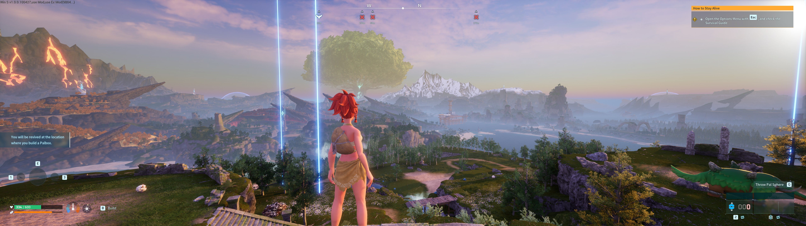
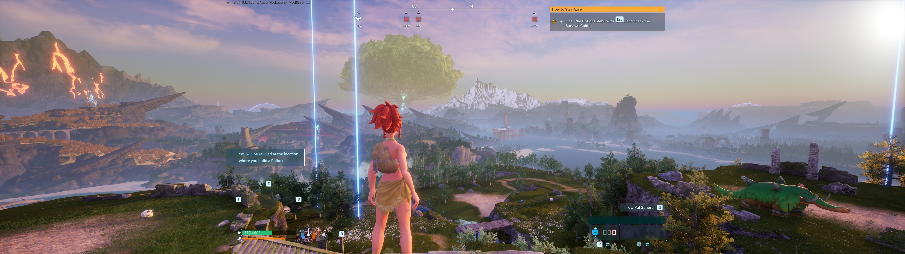

# PalworldCenteredHUD

> **Work in progress** — this mod is under active development. Tested against Palworld 1.0 on Steam, build **v1.0.0.100427** (July 2026), at 5120x1440 (32:9) and 3440x1440 (21:9). Expect rough edges; issues and reports are welcome.

> **One download for every ultrawide** — the mod computes its layout from your actual screen aspect at runtime, so the same release works on 21:9 (3440x1440, 2560x1080), 32:9, and 48:9 triple-wide. Anything at or below 16:9 is automatically left vanilla. 32:9 and 21:9 have been hand-verified so far — reports from other aspects are especially welcome.

A UE4SS Lua mod that pulls Palworld's HUD toward the center on ultrawide and super-ultrawide displays (21:9 / 32:9). Features live toggle, config file, and per-widget tweaks for precise control over HUD element positioning.

## Before / After

Vanilla on a 5120x1440 (32:9) display — HUD elements pinned to the far edges:



With CenteredHUD — the HUD framed in a centered 16:9 region:



## Download

The latest release is available on the [Releases page](https://github.com/kotsaris/PalworldCenteredHUD/releases). Each release includes two ready-to-install zips: `CenteredHUD.zip` (the main mod) and `TimeSet.zip` (the standalone world-clock dev mod — see below).

## Install

**Via Vortex** (verified working): install the ["UE4SS Palworld" package from Nexus Mods](https://www.nexusmods.com/palworld/mods/3035), then add `CenteredHUD.zip` with **Install From File**, enable both, and deploy.

**Manually:**

1. Extract the `CenteredHUD.zip` into your Palworld mod directory:
   ```
   <Palworld>\Pal\Binaries\Win64\ue4ss\Mods\
   ```
   
2. Verify the structure — you should have `Mods\CenteredHUD\Scripts\main.lua` after extraction.

See [CenteredHUD/README.md](CenteredHUD/README.md#installation) for full instructions, including installing UE4SS itself.

## Bonus: TimeSet

The repo also contains [TimeSet](TimeSet/) — a tiny standalone UE4SS mod born as a development aid: press HOME to jump the world clock straight to night, END for morning (useful for testing weather/lighting-dependent HUD effects). Every release ships it as its own `TimeSet.zip`; install it the same way as CenteredHUD (Vortex **Install From File**, or extract the `TimeSet` folder into `ue4ss\Mods\`).

## Usage & Configuration

Full usage guide and configuration options are in [CenteredHUD/README.md](CenteredHUD/README.md).

For technical details on how the mod works, see [FINDINGS.md](FINDINGS.md).

## Requirements

- Palworld 1.0 (Steam) — last verified on build v1.0.0.100427 (July 2026)
- RE-UE4SS experimental-palworld build — as the ["UE4SS Palworld" Vortex package on Nexus](https://www.nexusmods.com/palworld/mods/3035) or [`UE4SS-Palworld.zip` from the official GitHub release](https://github.com/Okaetsu/RE-UE4SS/releases/tag/experimental-palworld)

## License

This project is licensed under the MIT License — see [LICENSE](LICENSE) for details.
