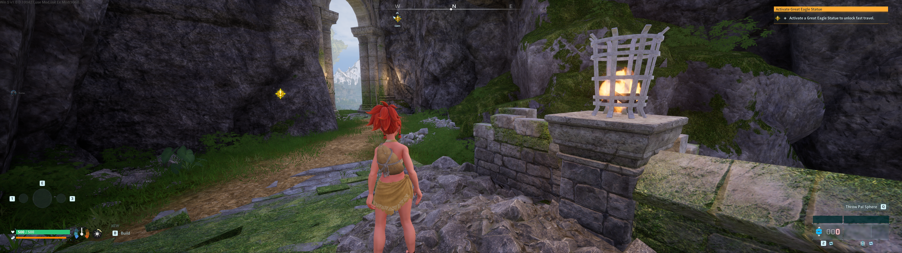

# PalworldCenteredHUD

> **Work in progress** — this mod is under active development and currently tested against a single setup (Palworld 1.0 on Steam at 5120x1440). Expect rough edges; issues and reports are welcome.

A UE4SS Lua mod that pulls Palworld's HUD toward the center on ultrawide and super-ultrawide displays (21:9 / 32:9). Features live toggle, config file, and per-widget tweaks for precise control over HUD element positioning.

## Before / After

Vanilla on a 5120x1440 (32:9) display — HUD elements pinned to the far edges:



With CenteredHUD — the HUD framed in a centered 16:9 region:


## Download

The latest release is available on the [Releases page](https://github.com/kotsaris/PalworldCenteredHUD/releases). Each release includes a ready-to-install `CenteredHUD.zip` containing the mod.

## Install

1. Extract the `CenteredHUD.zip` into your Palworld mod directory:
   ```
   <Palworld>\Pal\Binaries\Win64\ue4ss\Mods\
   ```
   
2. Verify the structure — you should have `Mods\CenteredHUD\Scripts\main.lua` after extraction.

3. The mod requires:
   - **Palworld 1.0** (Steam)
   - **RE-UE4SS** experimental-palworld build

## Bonus: TimeSet

The repo also contains [TimeSet](TimeSet/) — a tiny standalone UE4SS mod born as a development aid: press HOME to jump the world clock straight to night, END for morning (useful for testing weather/lighting-dependent HUD effects). Install it the same way: copy the `TimeSet` folder into `ue4ss\Mods\`.

## Usage & Configuration

Full usage guide and configuration options are in [CenteredHUD/README.md](CenteredHUD/README.md).

For technical details on how the mod works, see [FINDINGS.md](FINDINGS.md).

## Requirements

- Palworld 1.0 (Steam)
- RE-UE4SS experimental-palworld build

## License

This project is licensed under the MIT License — see [LICENSE](LICENSE) for details.
